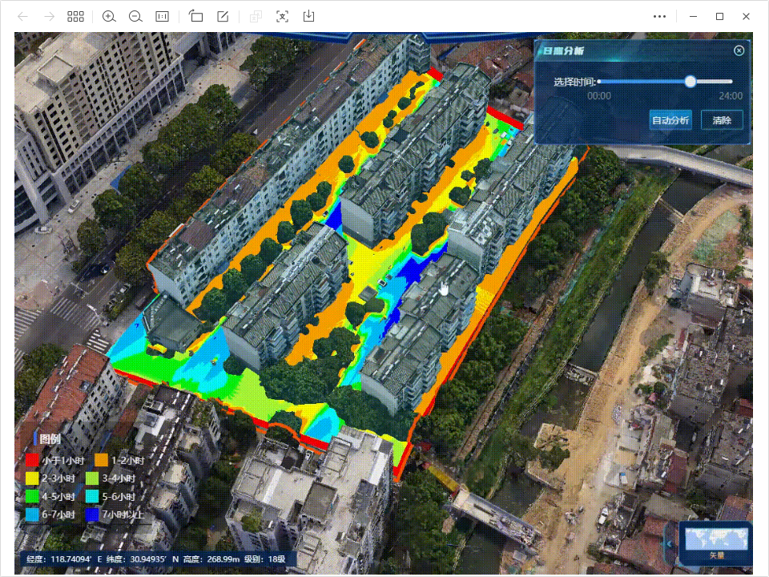

# pmap-rz
 <a href="">
    
  </a>

## ChangeLog
1.0.10 重大更新，分析结果可进行保存，未全面测试，需要可回退之前版本.


## 联系我
13247118869

## 简介

* pmap-rz
Cesium 日照分析sdk

## Demo（GIF）
 <a href="https://ponggis.xyz:8070/static/pmap-rz.gif">
   demo地址
 </a>



## Example
```
let legends=[
        {
            name:"1",
            title:"小于1小时",
            color:"#f50205",
            min:0,
            max:1,
        }, {
            name:"2",
            color:"#f9a100",
            title:"1-2小时",
            min:1,
            max:2,
        },
        {
            name:"3",
            color:"#f5f701",
            title:"2-3小时",
            min:2,
            max:3,
        },
        {
            name:"4",
            color:"#a7f637",
            title:"3-4小时",
            min:2,
            max:3,
        },
        {
            name:"5",
            color:"#08f210",
            title:"4-5小时",
            min:2,
            max:3,
        },{
            name:"6",
            color:"#06f4f7",
            title:"5-6小时",
            min:2,
            max:3,
        },{
            name:"7",
            color:"#00baf6",
            title:"6-7小时",
            min:2,
            max:3,
        },{
            name:"8",
            color:"#0000f6",
            title:"7小时以上",
            min:2,
            max:3,
        }
    ];
this._rzprimitive = new pmap.RZPrimitiveX(viewer,{positions:hierarchy.positions,legends:this.legends,clampground:false,height:30});
viewer.scene.primitives.add(this._rzprimitive);
```


## Demo


